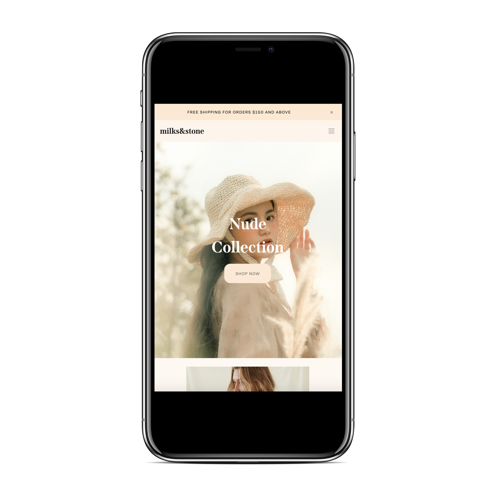
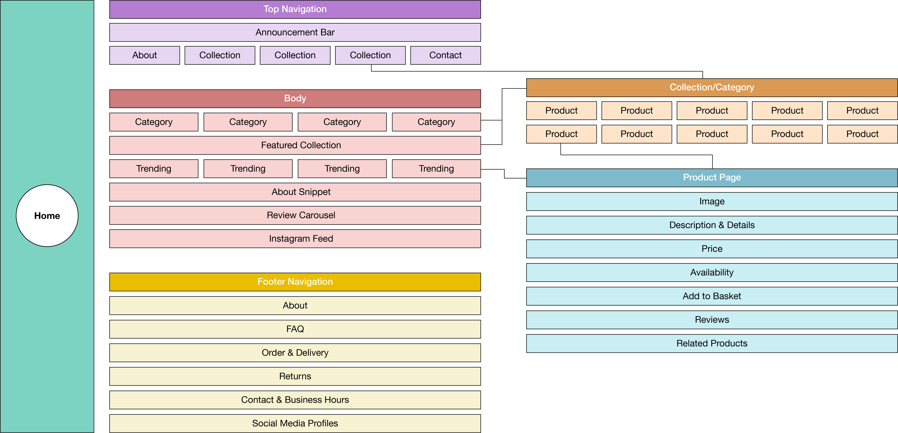
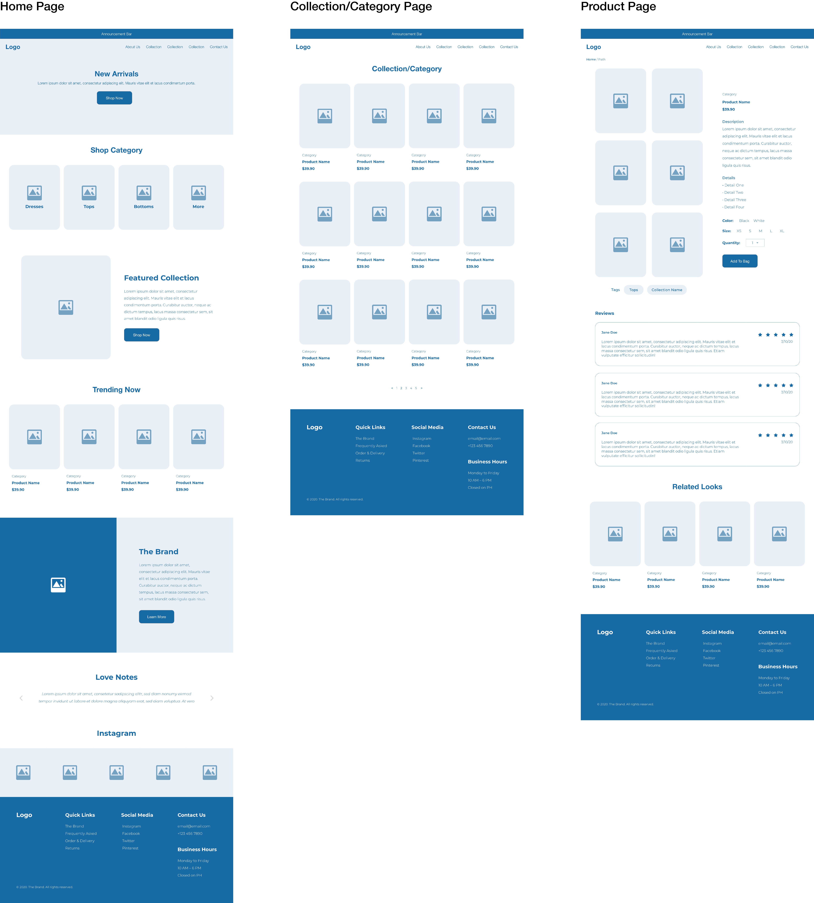
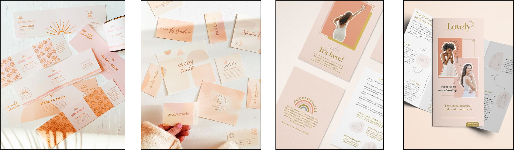

# User Centric Front-End Development
## Context
To build a static front-end site of at least 3 pages for a *clothing brand* using HTML and CSS to include/be:

- Sufficient information about the brand and the buying process
- Products with relavant description and details
- Any other information that is crucial to the shopper (e.g. shop policies)
- High resolution media (images and videos)
- User-friendly

**External User's Goal:** Purchase fashionable clothing from the brand.

**Site Owner's Goal:** Sell and present information about the brand and its products so that shoppers can make an informed decision when purchasing from the brand.

## Demo
Please find the live demo [here](https://charcln.github.io/tgc-project-1/).\



## Strategy and Scope
### Strategy
#### Identifying External Users
- The brand offers affordable mid-range contemporary fashion for young women from 18 to 35 years old who may be studying or working. 
- This group women enjoy posting and browsing social media on their phones to keep up with the latest happenings.
- Therefore, the site has to be mobile-friendly and have a design that is modern.

#### Identifying External User's Goals
- The main purpose for the external user to visit the site is to learn about the brand and shop the listings. 
- After finding out the necessary information for them to make an informed decision, they will then decide whether to purchase from the brand or buy from somewhere else.

```
EU1. Find out whether the brand's values and theirs are aligned.
EU2. Browse through the shop's offerings to determine if the products are to their liking.
EU3. Compare prices with similar shops.
EU4. Check whether the shop is based in their area and how long it takes to receive their order.
EU5. Read shop policies before (Shipping) or after (Exchange/Return/Refund) purchase.
EU6. Check whether their favored items are in-stock and available in their size.
```
A single shop may have hundreds of products for a user to browse through. This can be overwhelming. Therefore, data should be displayed in a detailed and concise (short-and-sweet) manner to prevent that from happening.

#### Identifying Site Owner's Goals
The main purpose for the site owner is to provide information about the brand and its products to shoppers to make a sale. The site should include/be:
```
SO1. Adaptable to different screen sizes.
SO2. Modern and attractive design.
SO3. Easy to use.
SO4. Information about the brand and its products.
SO5. Quick loading times.
SO6. Reviews and social proof.
```

#### User Stories
```
US1. As a shopper, I would like to look at who the brand is for so I can know if it is suited for me.
US2. As a shopper, I would like to look at the brand's listings so I can know if it matches my fashion sense.
US3. As a shopper, I would like to look at the prices so I can know if the items are within my budget.
US4. As a shopper, I would like to look at existing promotions, deals and offers so I can know whether I am eligble for them.
US5. As a shopper, I would like to look at reviews and social proof so I can build trust and confidence in the brand.
US6. As a shopper, I would like to look at the product descriptions and details so I can make an informed decision.
US7. As a shopper, I would like to look at the product availability so I can know if I am able to get it according to my needs, such as colors and sizes.
US8. As a shopper, I would like to look at shipping locations and times so I can know whether the brand ships to my area and when to expect the items.
US9. As a shoper, I would like to follow the brand on Instagram which I frequently use so I can know the latest updates and promotions.
US10. As a shoper, I would like to look at the exchange and refund policy so I can know if my items are eligible for them.
```

### Scope
#### Functional Requirement
```
FR1. Allow user to browse through listings easily and in an organised manner (EU2)(SO3, 4)
FR2. Menu that allows user to click into different pages such as About, Policy and Contact (EU1, 4-5)(SO4)
FR3. Indication of product availability (EU6)
FR4. Appropriate buttons or the likes of it to minimise user clicks (SO3)
FR5. Compressed media files (SO5)
FR6. Carousel for featured reviews and Instagram section (SO6)
FR7. At least 3 pages, or (if using a single scrolling page), at least 3 separate page areas. [Project requirement]
FR8. Main navigation menu and a structured layout. [Project requirement]
```

#### Content Requirement
```
CR1. Reviews (US5)
CR2. Social proof (US5)
CR3. Related items upon clicking into a product page (SO3)
CR4. Frequently Asked Questions (FAQ) (SO3)
CR5. Policies: Exchange and Refund, Shipping (US8, 10)
CR6. About the brand (US1)
CR7. Product descriptions and details (US6)
CR8. Price (US3)
CR9. Product availibilty (US7)
CR10. Contact options and business hours
```
## Developing the Site Structure and Organisation
### Site Structure


### Wireframes



## User Interface (UI)
### Mood


- Modern
- Delightful
- Gentle
- Lovely
- Soft

### Color


## Technologies Used
- HTML5
- CSS
- Bootstrap
- GitHub

## Libraries
- Adobe Fonts
- Bootstrap
- FontAwesome

## Existing Features
- Homepage\
The homepage has a hero banner that displays an image of the new collection with a button that is linked to it. There is an announcement bar at the top that can be dismissed upon clicking the "x" icon on the right hand side. The page also shows product catergories so that users are able to easily browse through what they want to look for such as top, bottoms, dresses and jumpsuits. The collection is also featured at the middle section of the page with a brief description about the collection. Users are able to click on the button that is linked to the collection. The section after features what is trending for the shop which users can click which brings them to the product page specifying the details of the product. A short introduction of the shop which allows users to know more about the shop. Lastly, a carousel which shows reviews from customers who have bought our product. 

- Navbar\
The navbar includes the shop name and navigation menu for users to have a quicker access to specific page.When on mobile, it will turn into a hamburger menu which enhance the user experience and appearance of the website. 

- Collection Page\
The collection page allows users to browse through our existing products. The products are organized neatly such that users are able to see a clearer picture of the products. By clicking on it, it will bring them to the product page. 

- Product Page\
The product page shows the price, desciption, product details and size available for the product. Users area able to add to basket in this page. Reviews are shown when scrolled down which allows users to hear more from our customers before making a decision. 

- Shipping Policy Page\
The shipping policy page explains the delivery methods, shipping proccessing time and shipping rates. This allows the user to have a clearer understanding on the shipping procedure which the shop uses. 

- Return Policy Page\
The return policy page explains the steps needed when users want to return an item or a refund. 

- Footer\
In the footer section, it contains the quick links section where it has the same function as the navbar for users to have quick access if needed. Social Media section is also available for users to head to the shop social media account to see and know more about the shop. Lastly the contact us portion where users will be able to contact through email or phone number. Business opening hours is also included. 

## Features Left To Implement
- To include an add to cart page.
- Quantity and size selector for the product page. 
- Tags for product to link and show products with relevant tags. (i.e display all off-shoulder tops when user clicks the #off-shoulder tag.)
- To have an instagram section in the website.
- Checkout page which includes items from cart and payment method. 
- Search bar to search for related products. 
- Pop up alerts upon site entry displaying the current promotions the shop is having. 
- Newsletter sign up. 
- Inclide product availability, specific product discounts and selling fast notifications. 
- To include more product pictures as the current webpage only includes four product pictures. 

### Validators
- HTML (https://validator.w3.org/)
- CSS (https://jigsaw.w3.org/css-validator/)

### Manual Testing
| Test Case  | Description          | Outcome  |
| ------------- |:-------------| -----|
| 1         | In index.html link in the navbar leads to the specific page when clicked | Pass |
| 2        | In index.html, buttons are responsive and leads to specific page when clicked | Pass |
|3 | In index.html, carousel next and previous buttons are working. | Pass|
| 4 | In index.html, Footer links are working. | Pass |
| 5 | In index.html, external links are opened in a new tab. | Pass | 
| 6 | In collection.html, products are organized neatly and easy to read. | Pass|
| 7 | In delivery-policy.html and return-policy.html, proper spacing and easy to read. | Pass|
| 8 | Stick navbar is working well. Remains at the top when scrolling down. | Pass|
| 9 | Logo in the navbar brings you to index.html when clicked. | Pass |
| 10 | Responsive for both desktop and mobile. | Pass |

## Deployment
The project was done on Visual Studio Code and Github. 

- Github repositry created.
- Link was copied and cloned locally with Visual Studio code such that webpage can run locally. 
- Commits were pushed to GitHub for version control and webpage will be updated. 

## Credits
### Fonts
Adobe Fonts

## Images
Shop Category - Dress (https://us.fashionbunker.com/shop/clothing/dresses)

Shop Category - Bottoms (https://www.stradivarius.com/)

Shop Category - Tops (https://andjelacollection.com/products/loren-top-in-ivory)

Shop Category - Jumpsuits (https://www.selfieleslie.com/kaia-ruffle-strap-wide-leg-capri-jumpsuit-beige)

About (https://weheartit.com/entry/308953101)

## Codes
Responsive Image Gallery (https://www.w3schools.com/howto/howto_css_image_grid_responsive.asp)

Reviews (https://bootsnipp.com/snippets/M5obX)

Bootstrap (https://getbootstrap.com)

## Others
Shop Reviews (https://www.yoursclothing.com/customer-feedback)

Delivery Policy (https://www.termsfeed.com/blog/sample-shipping-policy-template/)

Return Policy (https://docs.google.com/document/d/1xLNxzUbNgR6eml-VZXuSApX3d6DyYtuxjqUDvYCaWy0/edit)

Sample Products (https://thereformation.com)

Icons (FontAwesome https://fontawesome.com)
